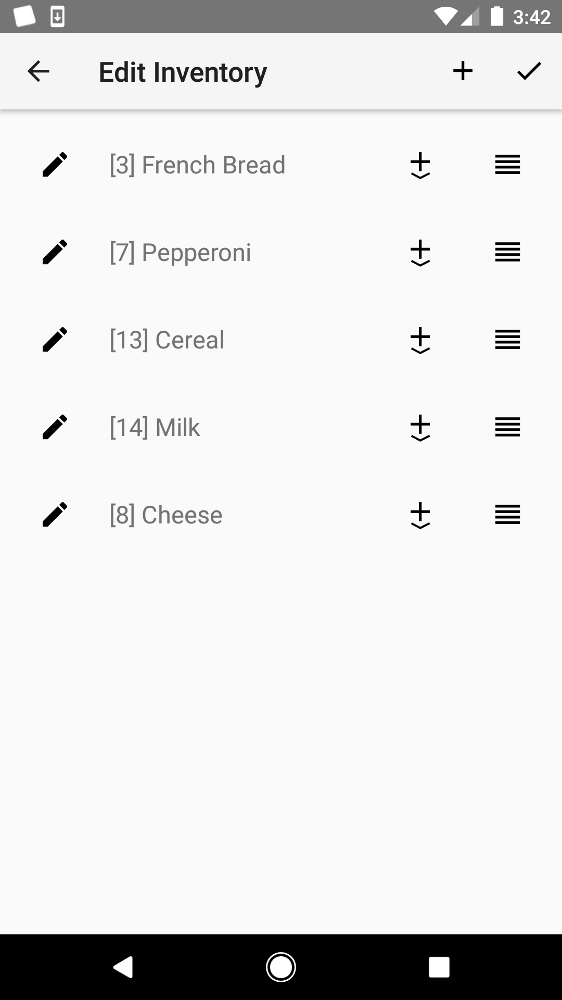
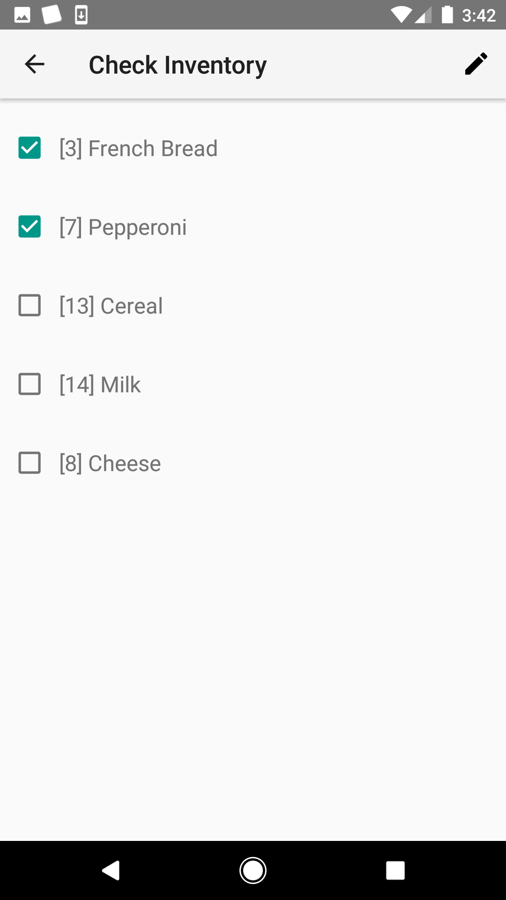
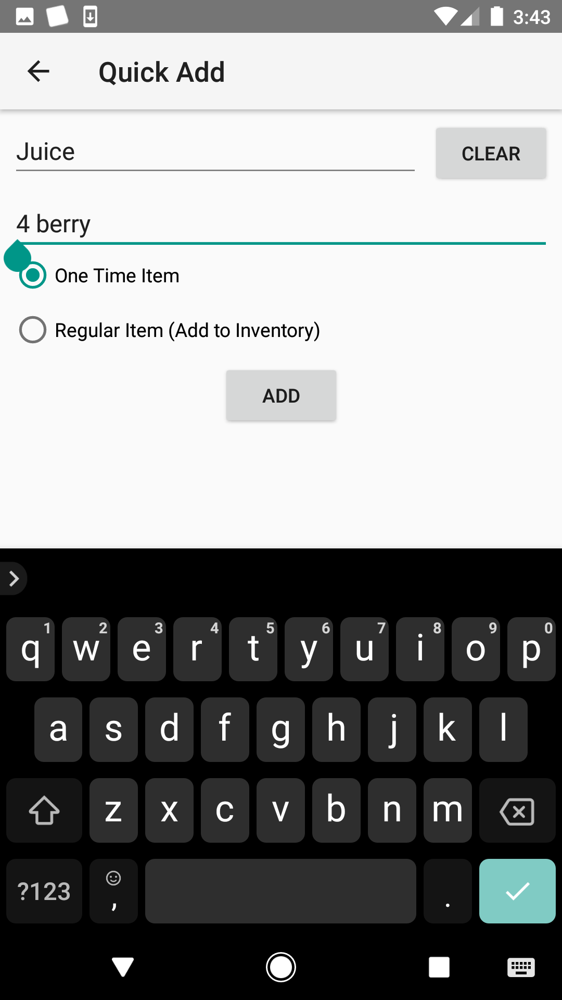
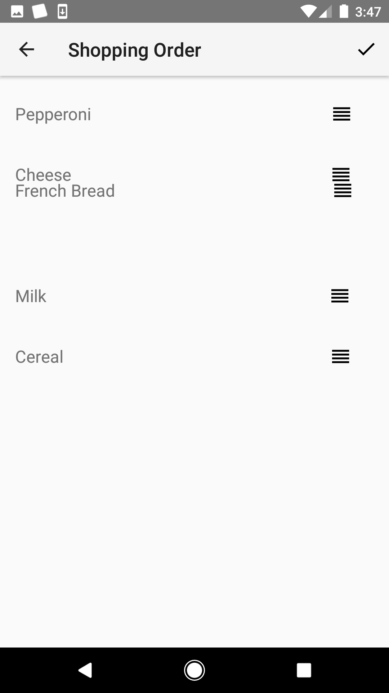

# About

GroceryRun is a simple grocery list for Android (my first Android app).  It
can maintain an inventory and set specific orders for inventory check and
shopping lists with drag and drop.

# Features

* Items can be kept in an inventory list to check on in the future and add quickly or simply stored as one-off items

* "Quick add" will autocomplete based on inventory items

* Set list orders with drag & drop

* Different ordering of items for inventory check versus shopping

* Import from text files (with SAF support)

* Data stored in local sqlite database

# Screen Shots

# Copyright and License

Copyright (C) 2017 Steve Benson

GroceryRun was written by Steve Benson.

GroceryRun is free software; you can redistribute it and/or modify it under
the terms of the GNU General Public License as published by the Free
Software Foundation; either version 3, or (at your option) any later
version.

GroceryRun is distributed in the hope that it will be useful, but WITHOUT ANY
WARRANTY; without even the implied warranty of MERCHANTABILITY or FITNESS
FOR A PARTICULAR PURPOSE.  See the GNU General Public License for more
details.

You should have received a copy of the GNU General Public License along with
this program; see the file LICENSE.  If not, see <http://www.gnu.org/licenses/>.
